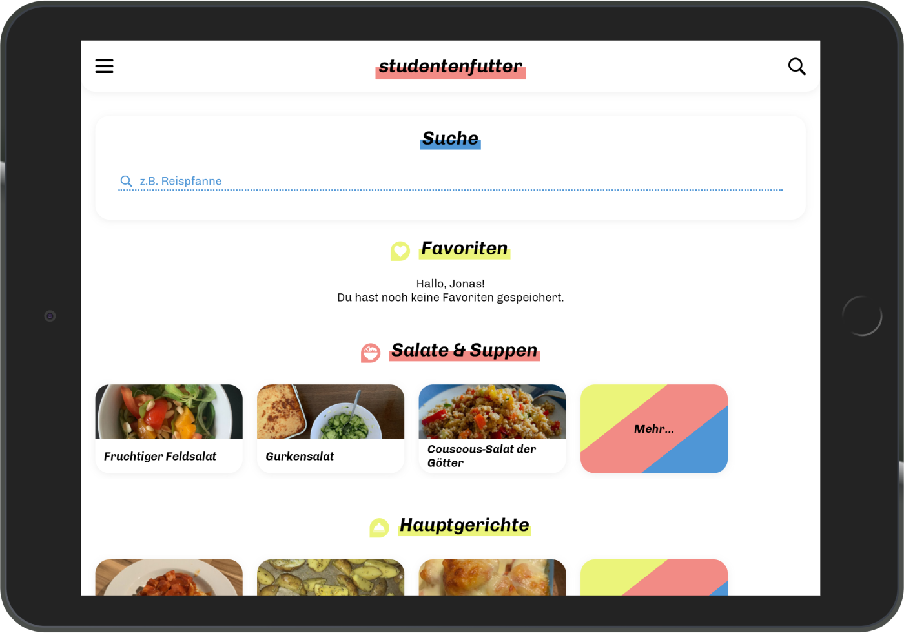

<h1 align="center">studentenfutter</h1>

<b>🥗 Web app for student cookbook "studentenfutter"</b>

 
 

  

  
  
  

 
 

## Instructions

#### Clone the repo

`> git clone --recurse-submodules https://github.com/jonaskuske/studentenfutter`

> If you clone the repo without `--recurse-submodules`, run `git submodule update --init --recursive` in the project dir.

#### Install dependencies

`> npm install`

#### Development

`> npm start` (requires PHP >= 7.2 with `curl`, `ctype`, `mbstring` and `gd` extensions)

> Then visit [`localhost:8000`](http://localhost:8000) (or [`localhost:8000/panel`](http://localhost:8000/panel) for the admin panel) 👍🏻

#### Build for production

`> npm run build`

 

---

Built with [Kirby CMS](https://getkirby.com), [TailwindCSS](https://tailwindcss.com) and [Alpine.js](https://github.com/alpinejs/alpine)
.
